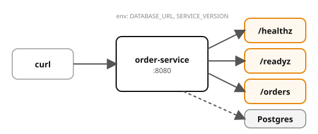

# Example 01 — Cloud-Native Principles

Demonstrates the two twelve-factor concerns you still write per service:
**config from the environment** (factor III) and **liveness vs readiness probes**.

## Prerequisites

- [Podman](https://podman.io/getting-started/installation) with
  [podman-compose](https://github.com/containers/podman-compose) or the
  Docker Compose plugin
- `curl` and `jq` for driving the API
- ~2 GB free memory (LGTM + Postgres + app service)

See the [shared infrastructure README](../_infra/README.md) for ports,
credentials, and the container naming convention.

## What it shows

| Concept | Where | What |
|---------|-------|------|
| Env-based config | environment variables | `DATABASE_URL`, `KAFKA_BOOTSTRAP`, `SERVICE_VERSION` — one image, many environments |
| Liveness probe | `/healthz` | Always returns ok if the process is up — never checks dependencies |
| Readiness probe | `/readyz` | Checks the database — fails when DB is down, recovers when DB recovers |
| OTel instrumentation | auto-instrumented | Traces and metrics sent to the LGTM stack |

## Architecture



## Run it

Pick a language and start the stack:

```bash
# Python (FastAPI)
cd python && podman compose up --build -d

# Spring Boot
cd spring-boot && podman compose up --build -d
```

Both implementations expose the same API on the same ports — `verify.sh` works with either.

Wait for all services to report healthy:

```bash
podman compose ps
```

## Drive it

```bash
# Check liveness
curl -s localhost:8080/healthz | jq .

# Check readiness
curl -s localhost:8080/readyz | jq .

# Create an order
curl -s -X POST 'localhost:8080/orders?customer=alice&total=42.50' | jq .

# List orders
curl -s localhost:8080/orders | jq .

# Stop Postgres and watch readiness flip (liveness stays ok)
podman stop cndp-postgres
curl -s localhost:8080/readyz | jq .   # → "status": "down"
curl -s localhost:8080/healthz | jq .  # → "status": "ok"

# Restart Postgres and watch readiness recover
podman start cndp-postgres
sleep 3
curl -s localhost:8080/readyz | jq .   # → "status": "ready"
```

## Verify

From the example root (not the language directory):

```bash
cd ..  # if you're in a language directory
./verify.sh
```

## Observe

Open Grafana at http://localhost:3000 and explore:

- **Tempo** — traces for each HTTP request
- **Loki** — structured logs from the order-service
- **Prometheus** — HTTP request metrics (duration, count)

## Ports

| Service | Port |
|---------|------|
| order-service | 8080 |
| Grafana | 3000 |
| Postgres | 5432 |
| OTLP HTTP | 4318 |
