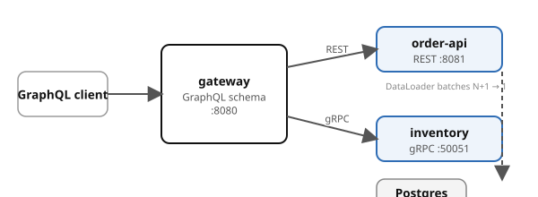

# Example 03 — Composition

Demonstrates **GraphQL gateway composition**: a single gateway fans out to a
REST backend (order-api) and a gRPC backend (inventory), resolving fields
on-demand and batching with DataLoader.

## Prerequisites

- [Podman](https://podman.io/getting-started/installation) with
  [podman-compose](https://github.com/containers/podman-compose) or the
  Docker Compose plugin
- `curl` and `jq` for driving the API
- ~2.5 GB free memory (LGTM + Postgres + three app services)

See the [shared infrastructure README](../_infra/README.md) for ports,
credentials, and the container naming convention.

## What it shows

| Pattern | Where | What |
|---------|-------|------|
| Gateway fan-out | gateway → order-api (REST) | Orders fetched via HTTP from the REST backend |
| On-demand resolution | `stock` field | Inventory gRPC only called when the client requests `stock` |
| DataLoader batching | `stock` across a list | Multiple SKUs batched into one `GetStockBatch` gRPC call, not N+1 |

## Architecture



## Run it

Pick a language and start the stack:

```bash
# Python (FastAPI)
cd python && podman compose up --build -d

# Spring Boot
cd spring-boot && podman compose up --build -d
```

Both implementations expose the same API on the same ports — `verify.sh` works with either.

Wait for all services to report healthy:

```bash
podman compose ps
```

## Drive it

```bash
# Query orders without stock — only order-api is called
curl -s -X POST -H 'Content-Type: application/json' \
  -d '{"query":"{ orders { id sku status } }"}' \
  localhost:8080/graphql | jq .

# Query with stock — triggers gRPC to inventory, batched by DataLoader
curl -s -X POST -H 'Content-Type: application/json' \
  -d '{"query":"{ orders { id sku stock } }"}' \
  localhost:8080/graphql | jq .

# Single order by ID with stock
curl -s -X POST -H 'Content-Type: application/json' \
  -d '{"query":"{ order(id: \"ord-001\") { id sku quantity stock } }"}' \
  localhost:8080/graphql | jq .

# Check gateway logs for DataLoader batching
podman logs cndp-gateway 2>&1 | grep "DataLoader"
```

## Verify

From the example root (not the language directory):

```bash
cd ..  # if you're in a language directory
./verify.sh
```

## Observe

Open Grafana at http://localhost:3000 and explore:

- **Tempo** — traces show the gateway fanning out to order-api (REST) and
  inventory (gRPC) in parallel
- **Loki** — DataLoader batch log lines from the gateway

## Ports

| Service | Port |
|---------|------|
| gateway (GraphQL) | 8080 |
| order-api (REST) | 8081 |
| inventory (gRPC) | 50051 |
| Grafana | 3000 |
| Postgres | 5432 |
| OTLP HTTP | 4318 |
