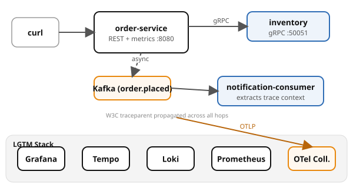

# Example 11 — Observability

Demonstrates the **three pillars of observability** — traces, metrics, and logs
— correlated by trace ID across three services using OpenTelemetry and the LGTM
stack (Loki, Grafana, Tempo, Mimir/Prometheus).

## Prerequisites

- [Podman](https://podman.io/getting-started/installation) with
  [podman-compose](https://github.com/containers/podman-compose) or the
  Docker Compose plugin
- `curl` and `jq` for driving the API
- ~4 GB free memory (LGTM + Postgres + Kafka + 3 app services)

See the [shared infrastructure README](../_infra/README.md) for ports,
credentials, and the container naming convention.

## What it shows

| Signal | Where | What |
|--------|-------|------|
| **Traces** | Tempo | One trace spans REST (order-service) → gRPC (inventory) → Kafka → consumer |
| **Metrics** | Prometheus | `orders.placed` counter, `stock.reservations` counter with labels |
| **Correlated logs** | Loki | Every log line carries `trace_id` — jump from log to trace |
| **W3C propagation** | All hops | `traceparent` header flows across REST, gRPC, and Kafka headers |

## Architecture



## Run it

Pick a language and start the stack:

```bash
# Python (FastAPI)
cd python && podman compose up --build -d

# Spring Boot
cd spring-boot && podman compose up --build -d
```

Both implementations expose the same API on the same ports — `verify.sh` works with either.

Wait for all services:

```bash
podman compose ps
```

## Drive it

```bash
# Place an order
curl -s -X POST -H 'Content-Type: application/json' \
  -d '{"sku":"widget-a","quantity":2}' \
  localhost:8080/orders | jq .

# Find the trace_id in the logs
podman logs cndp-order-service 2>&1 | grep "order placed"

# Search Tempo for the trace
TRACE_ID=<from logs>
curl -s http://localhost:3200/api/traces/$TRACE_ID | jq .

# Query Prometheus for the metric
curl -s 'http://localhost:9090/api/v1/query?query=orders_placed_total' | jq .

# Search Loki for correlated logs
curl -s 'http://localhost:3100/loki/api/v1/query_range' \
  --data-urlencode 'query={compose_service="order-service"}' | jq .
```

## Verify

From the example root (not the language directory):

```bash
cd ..  # if you're in a language directory
./verify.sh
```

## Observe

Open Grafana at http://localhost:3000:

- **Tempo** — search for traces by service name; click a trace to see the
  waterfall across order-service → inventory-service → notification-consumer
- **Explore → Prometheus** — query `orders_placed_total` or `stock_reservations_total`
- **Explore → Loki** — filter by `{compose_service="order-service"}`, then
  click a log line's trace ID to jump to the trace in Tempo

## Ports

| Service | Port |
|---------|------|
| order-service | 8080 |
| Grafana | 3000 |
| Tempo | 3200 |
| Loki | 3100 |
| Prometheus | 9090 |
| Postgres | 5432 |
| Kafka (host) | 9092 |
| Kafka UI | 8090 |
| OTLP HTTP | 4318 |
