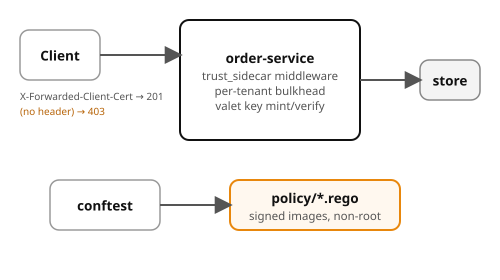

# Example 12 — Security

Demonstrates three of the seven security patterns from the chapter:
**sidecar trust** (deny without the mesh-set identity header),
**valet key** (mint scoped, time-bound HMAC tokens), and
**per-tenant bulkhead** (bounded concurrency per tenant). Also includes
OPA Rego **policy-as-code** that blocks untrusted images and privileged
containers, testable with `conftest`.

## Prerequisites

- [Podman](https://podman.io/getting-started/installation) with
  [podman-compose](https://github.com/containers/podman-compose) or the
  Docker Compose plugin
- `curl` and `python3` for driving the API
- (Optional) [conftest](https://www.conftest.dev/install/) for
  policy-as-code checks
- ~256 MB free memory (single lightweight service)

## What it shows

| Concept | Where | What |
|---------|-------|------|
| Sidecar trust | middleware | 403 without `X-Forwarded-Client-Cert`; trusts sidecar headers |
| Valet key | `/valet-key`, `/verify-valet` | HMAC-signed, time-bound, operation-scoped tokens |
| Per-tenant bulkhead | concurrency limiter | 5 concurrent requests per tenant; one tenant's storm can't drain another |
| Policy-as-code | `policy/` | OPA Rego denies untrusted images, privileged containers, root UID |

## Architecture



## Run it

Pick a language and start the stack:

```bash
# Python (FastAPI)
cd python && podman compose up --build -d

# Spring Boot
cd spring-boot && podman compose up --build -d
```

Both implementations expose the same API on the same ports — `verify.sh` works with either.

```bash
# Denied — no identity header
curl -s http://localhost:8080/orders   # → 403

# Trusted — sidecar would set this header
curl -s -X POST http://localhost:8080/orders \
  -H 'Content-Type: application/json' \
  -H 'X-Forwarded-Client-Cert: spiffe://cluster.local/ns/orders/sa/order-service' \
  -d '{"sku":"widget","quantity":1,"tenant":"acme"}'

# Mint a valet key
curl -s -X POST 'http://localhost:8080/valet-key?resource=file.csv&operation=GET' \
  -H 'X-Forwarded-Client-Cert: spiffe://test'

# Policy-as-code (requires conftest)
conftest test policy/good-deploy.yaml -p policy/signed_images.rego
conftest test policy/bad-deploy.yaml  -p policy/signed_images.rego
```

## Verify

From the example root (not the language directory):

```bash
cd ..  # if you're in a language directory
./verify.sh
```

## Ports

| Service | Port |
|---------|------|
| order-service | 8080 |
