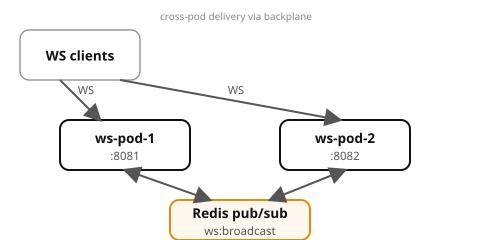

# Example 16 — WebSockets at Scale

Demonstrates **WebSocket scale-out with a Redis pub/sub backplane**: two
independent WebSocket server pods share a Redis channel so a message sent to
one pod reaches clients connected to the other. Messages carry monotonic
sequence numbers for resume-after-disconnect.

## Prerequisites

- [Podman](https://podman.io/getting-started/installation) with
  [podman-compose](https://github.com/containers/podman-compose) or the
  Docker Compose plugin
- `curl` and `jq` for driving the API
- Python 3 with `websockets` and `aiohttp` packages (for verify.sh)
- ~2 GB free memory (LGTM + Redis + 2 ws-server pods)

See the [shared infrastructure README](../_infra/README.md) for ports,
credentials, and the container naming convention.

## What it shows

| Pattern | Where | What |
|---------|-------|------|
| Redis pub/sub backplane | both ws-pods | All pods subscribe to `ws:broadcast`; any pod can reach any client |
| Cross-pod delivery | verify.sh | Client on pod-1 receives a message sent via pod-2's REST API |
| Broadcast | `/send` (no target) | Message fanned out to all connected clients on all pods |
| Sequence-number framing | every message | Monotonic `seq` enables resume from last ack |

## Architecture



## Run it

Pick a language and start the stack:

```bash
# Python (FastAPI)
cd python && podman compose up --build -d

# Spring Boot
cd spring-boot && podman compose up --build -d
```

Both implementations expose the same API on the same ports — `verify.sh` works with either.

Wait for all services:

```bash
podman compose ps
```

## Drive it

```bash
# Check both pods
curl -s localhost:8081/healthz | jq .
curl -s localhost:8082/healthz | jq .

# Connect a WebSocket client to pod-1
python3 -c "
import asyncio, json, websockets
async def main():
    async with websockets.connect('ws://localhost:8081/ws/my-client') as ws:
        await ws.send(json.dumps({'type': 'ping'}))
        print(await ws.recv())
asyncio.run(main())
"

# Send a message to that client via pod-2 (crosses the backplane)
curl -s -X POST 'localhost:8082/send?target=my-client&message=hello-from-pod2'
```

## Verify

From the example root (not the language directory):

```bash
cd ..  # if you're in a language directory
./verify.sh
```

## Observe

Open Grafana at http://localhost:3000:

- **Tempo** — traces show WebSocket connection and REST /send calls

## Ports

| Service | Port |
|---------|------|
| ws-pod-1 | 8081 |
| ws-pod-2 | 8082 |
| Redis | 6379 |
| Grafana | 3000 |
| OTLP HTTP | 4318 |
