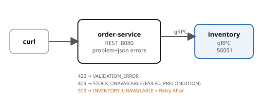

# Example 18 — API Error Handling

Demonstrates a **unified error contract** across REST and gRPC. Every error
carries the same five facts: stable machine code, safe message, trace ID,
retryable flag, and field-level details. The REST layer uses RFC 9457
`application/problem+json`; the gRPC layer uses status codes with
`google.rpc.Status` details (including `RetryInfo`).

## Prerequisites

- [Podman](https://podman.io/getting-started/installation) with
  [podman-compose](https://github.com/containers/podman-compose) or the
  Docker Compose plugin
- `curl` and `jq` for driving the API
- ~2 GB free memory (LGTM + 2 app services)

See the [shared infrastructure README](../_infra/README.md) for ports,
credentials, and the container naming convention.

## What it shows

| Error scenario | Status | Code | Retryable | What |
|----------------|--------|------|-----------|------|
| Validation failure | 422 | `VALIDATION_ERROR` | no | Missing/invalid fields with details |
| Stock exhausted | 409 | `STOCK_UNAVAILABLE` | no | gRPC `FAILED_PRECONDITION` → REST 409 |
| Inventory down | 503 | `INVENTORY_UNAVAILABLE` | yes | gRPC `UNAVAILABLE` → REST 503 + `Retry-After` |

## Architecture



## Run it

Pick a language and start the stack:

```bash
# Python (FastAPI)
cd python && podman compose up --build -d

# Spring Boot
cd spring-boot && podman compose up --build -d
```

Both implementations expose the same API on the same ports — `verify.sh` works with either.

## Drive it

```bash
# Happy path
curl -s -X POST -H 'Content-Type: application/json' \
  -d '{"sku":"widget","quantity":1}' \
  localhost:8080/orders | jq .

# Validation error (422)
curl -s -X POST -H 'Content-Type: application/json' \
  -d '{"sku":"","quantity":0}' \
  localhost:8080/orders | jq .

# Exhaust stock (inventory starts with 5 units)
for i in $(seq 1 6); do
  curl -s -X POST -H 'Content-Type: application/json' \
    -d '{"sku":"limited","quantity":1}' \
    localhost:8080/orders | jq .code
done

# Service unavailable (stop inventory)
podman stop cndp-inventory
curl -si -X POST -H 'Content-Type: application/json' \
  -d '{"sku":"widget","quantity":1}' \
  localhost:8080/orders
```

## Verify

From the example root (not the language directory):

```bash
cd ..  # if you're in a language directory
./verify.sh
```

## Ports

| Service | Port |
|---------|------|
| order-service | 8080 |
| Grafana | 3000 |
| OTLP HTTP | 4318 |
