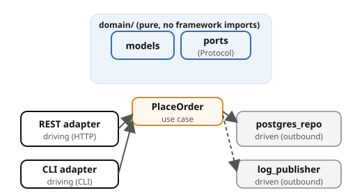

# Example 19 — DDD & Hexagonal Architecture

Demonstrates **hexagonal architecture** (ports and adapters) with a clean
domain core that has **zero framework imports**. The same `PlaceOrder` use
case is driven by two independent adapters — REST and CLI — proving that
the domain is protocol-agnostic.

## Prerequisites

- [Podman](https://podman.io/getting-started/installation) with
  [podman-compose](https://github.com/containers/podman-compose) or the
  Docker Compose plugin
- `curl` and `jq` for driving the API
- ~1 GB free memory (Postgres + 1 app service)

See the [shared infrastructure README](../_infra/README.md) for ports,
credentials, and the container naming convention.

## What it shows

| Concept | Where | What |
|---------|-------|------|
| Pure domain core | `domain/` | Models, ports, and service — pure domain (no framework imports) |
| Outbound ports | domain ports | `OrderRepository` and `EventPublisher` as port interfaces |
| Application service | domain service | `PlaceOrder` — imports only domain types |
| REST driving adapter | REST adapter | HTTP routes calling the use case |
| CLI driving adapter | CLI adapter | CLI script calling the same use case |
| Postgres driven adapter | Postgres repository | Implements `OrderRepository` via database driver |
| Log driven adapter | log publisher | Implements `EventPublisher` via structured logging |
| Dependency inversion | application entrypoint | Wires adapters into domain service at startup |

## Architecture



## Run it

Pick a language and start the stack:

```bash
# Python (FastAPI)
cd python && podman compose up --build -d

# Spring Boot
cd spring-boot && podman compose up --build -d
```

Both implementations expose the same API on the same ports — `verify.sh` works with either.

```bash
# Place an order via REST
curl -s -X POST http://localhost:8080/orders \
  -H 'Content-Type: application/json' \
  -d '{"sku":"widget-a","quantity":3}' | jq .

# Place an order via CLI (same use case, different adapter)
podman exec cndp-order-service python cli_place_order.py bolt-x 5

# Verify both orders appear
curl -s http://localhost:8080/orders | jq .
```

## The cross-check

Grep the domain directory for framework imports — there should be none. The CLI
adapter calls the same `PlaceOrder` use case without touching any domain file —
only a new adapter appears.

## Verify

From the example root (not the language directory):

```bash
cd ..  # if you're in a language directory
./verify.sh
```

## Ports

| Service | Port |
|---------|------|
| order-service | 8080 |
| Postgres | 5432 |
