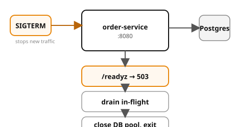

# Example 21 — Graceful Shutdown

Demonstrates the **Kubernetes-aware graceful shutdown protocol**: on SIGTERM,
the service flips readiness to 503 (so the load balancer stops sending new
traffic), drains in-flight requests, and then closes resources cleanly.

## Prerequisites

- [Podman](https://podman.io/getting-started/installation) with
  [podman-compose](https://github.com/containers/podman-compose) or the
  Docker Compose plugin
- `curl` and `jq` for driving the API
- ~1 GB free memory (Postgres + 1 app service)

See the [shared infrastructure README](../_infra/README.md) for ports,
credentials, and the container naming convention.

## What it shows

| Pattern | Where | What |
|---------|-------|------|
| SIGTERM handler | signal handler | Sets `shutting_down` flag on signal |
| Readiness flip | `/readyz` | Returns 503 when shutting down |
| In-flight drain | shutdown hook | Waits for `in_flight == 0` before closing pool |
| Data survives restart | verify.sh | Orders placed before restart are still queryable after |

## Architecture



## Run it

Pick a language and start the stack:

```bash
# Python (FastAPI)
cd python && podman compose up --build -d

# Spring Boot
cd spring-boot && podman compose up --build -d
```

Both implementations expose the same API on the same ports — `verify.sh` works with either.

## Drive it

```bash
# Verify service is ready
curl -s localhost:8080/readyz | jq .

# Place an order
curl -s -X POST -H 'Content-Type: application/json' \
  -d '{"sku":"widget","quantity":1}' \
  localhost:8080/orders | jq .

# Send SIGTERM
podman exec cndp-order-service kill -SIGTERM 1

# Readiness should flip
curl -s localhost:8080/readyz | jq .

# Check internal state
curl -s localhost:8080/debug/state | jq .
```

## Verify

From the example root (not the language directory):

```bash
cd ..  # if you're in a language directory
./verify.sh
```

## Ports

| Service | Port |
|---------|------|
| order-service | 8080 |
| Postgres | 5432 |
