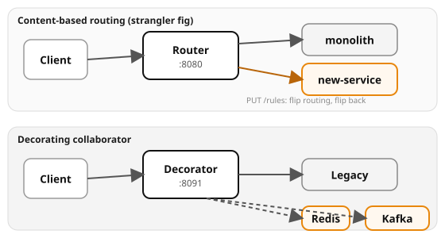

# Example 24 — Monolith to Microservices

Demonstrates two migration patterns: **content-based routing** (the
strangler fig) with reversible config, and the **decorating collaborator**
that wraps a legacy service with Redis caching and Kafka event emission
while the legacy stays untouched.

## Prerequisites

- [Podman](https://podman.io/getting-started/installation) with
  [podman-compose](https://github.com/containers/podman-compose) or the
  Docker Compose plugin
- `curl` and `python3` for driving the API
- ~2 GB free memory (Kafka + Redis + 5 app services)

See the [shared infrastructure README](../_infra/README.md) for ports,
credentials, and the container naming convention.

## What it shows

| Concept | Where | What |
|---------|-------|------|
| Content-based routing | `router/` | Routes by tenant field to monolith or new service |
| Reversibility | `PUT /rules` | Flip routing rules and flip back — no client change |
| Decorating collaborator | `decorator/` | Wraps legacy with Redis cache + Kafka events |
| Cache behavior | `GET /orders/{id}` | Second GET served from cache; legacy sees one call |
| Event emission | `POST /orders` | Legacy records write; decorator publishes to Kafka |
| Legacy untouched | `legacy` container | Same API, no knowledge of cache or events |

## Architecture



## Run it

Pick a language and start the stack:

```bash
# Python (FastAPI)
cd python && podman compose up --build -d

# Spring Boot
cd spring-boot && podman compose up --build -d
```

Both implementations expose the same API on the same ports — `verify.sh` works with either.

```bash
# Content-based routing
curl -s -X POST http://localhost:8080/orders \
  -H 'Content-Type: application/json' \
  -d '{"sku":"w","quantity":1,"tenant":"acme"}' | jq .source
# → "new-service"

# Reversibility — flip and flip back
curl -s -X PUT http://localhost:8080/rules \
  -H 'Content-Type: application/json' \
  -d '{"tenant_routes":{"acme":"monolith"},"default":"monolith"}'

# Decorating collaborator
curl -s -X POST http://localhost:8091/orders \
  -H 'Content-Type: application/json' \
  -d '{"sku":"item","quantity":1}' | jq .

curl -s http://localhost:8091/events | jq .
```

## Verify

From the example root (not the language directory):

```bash
cd ..  # if you're in a language directory
./verify.sh
```

## Ports

| Service | Port |
|---------|------|
| Router (content-based) | 8080 |
| Decorator (collaborator) | 8091 |
| Kafka | 9092 |
| Redis | 6379 |
