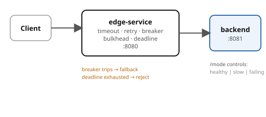

# Example 26 — Failure Modes

Demonstrates the **defensive toolkit** for distributed-system failure: timeouts,
retry with exponential backoff and jitter, circuit breakers with fallback,
deadline propagation, and bulkhead concurrency limiting.

## Prerequisites

- [Podman](https://podman.io/getting-started/installation) with
  [podman-compose](https://github.com/containers/podman-compose) or the
  Docker Compose plugin
- `curl` and `jq` for driving the API
- ~512 MB free memory (2 app services, no database)

See the [shared infrastructure README](../_infra/README.md) for ports,
credentials, and the container naming convention.

## What it shows

| Pattern | Endpoint | Behaviour |
|---------|----------|-----------|
| Timeout | `GET /with-timeout` | 2s client timeout; slow downstream fails fast |
| Retry + backoff | `GET /with-retry` | 3 attempts, exponential backoff with jitter |
| Circuit breaker | `GET /with-breaker` | Trips open after 5 failures, returns fallback, recovers via half-open |
| Deadline propagation | `GET /with-deadline?budget_ms=N` | Edge subtracts overhead, backend rejects if too little remains |
| Bulkhead | `GET /with-bulkhead` | Semaphore limits to 5 concurrent backend calls |
| No timeout (anti-pattern) | `GET /no-timeout` | Shows what goes wrong without a timeout |

## Architecture



## Run it

Pick a language and start the stack:

```bash
# Python (FastAPI)
cd python && podman compose up --build -d

# Spring Boot
cd spring-boot && podman compose up --build -d
```

Both implementations expose the same API on the same ports — `verify.sh` works with either.

## Drive it

```bash
# Normal call
curl -s localhost:8080/with-timeout | jq .

# Make backend slow → observe timeout
curl -s -X POST -H 'Content-Type: application/json' \
  -d '{"mode":"slow"}' localhost:8081/mode
curl -s localhost:8080/with-timeout | jq .

# Make backend fail → trip the breaker
curl -s -X POST -H 'Content-Type: application/json' \
  -d '{"mode":"failing"}' localhost:8081/mode
for i in $(seq 1 6); do curl -s localhost:8080/with-breaker | jq .; done
curl -s localhost:8080/breaker-state | jq .

# Deadline propagation with small budget
curl -s 'localhost:8080/with-deadline?budget_ms=80' | jq .
```

## Verify

From the example root (not the language directory):

```bash
cd ..  # if you're in a language directory
./verify.sh
```

## Ports

| Service | Port |
|---------|------|
| edge-service | 8080 |
| backend-service | 8081 |
